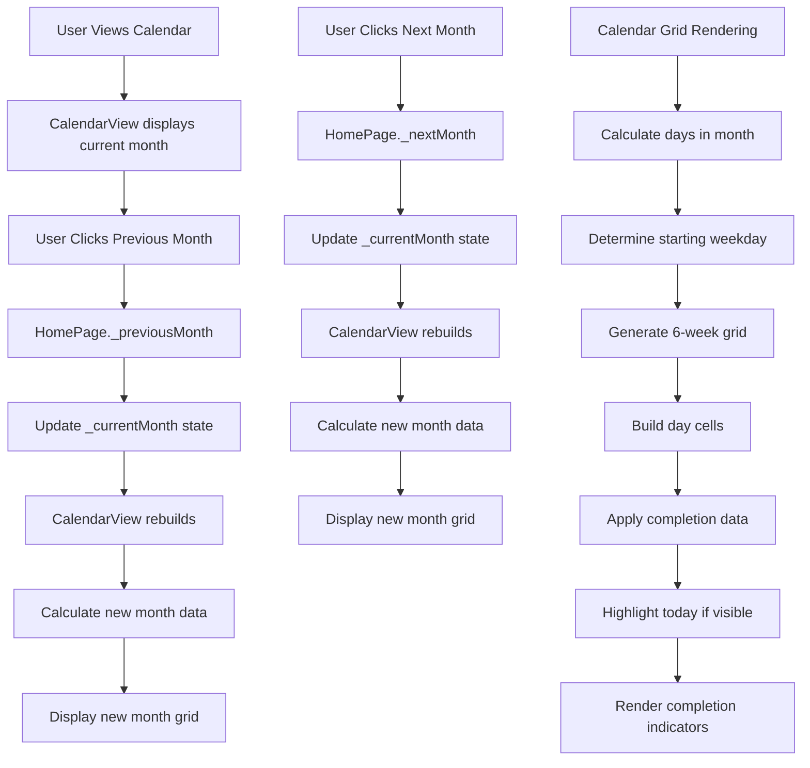

# Calendar Navigation Workflow

## Overview
This fluxogram illustrates how users navigate through the calendar to view historical habit completion data and track their progress over time.

## Workflow Steps

## Architecture Layers Involved

### Presentation Layer
- **CalendarView Widget**: Main calendar display component
- **HomePage**: State management for current month
- **Responsive Layout**: Adaptive calendar sizing

### Domain Layer
- **DateTime Logic**: Month calculations and date manipulations
- **Completion Data**: Aggregated completion counts per day

### Data Layer
- **Completion Data Map**: Pre-loaded completion data from today's entries
- **Historical Data**: Potential future extension for loading historical months

## Calendar Navigation Features

### Month Navigation
- **Previous Month Button**: Navigate to previous month
- **Next Month Button**: Navigate to next month
- **Current Month Display**: Clear month/year header
- **Boundary Handling**: Proper handling of year transitions

### Grid Calculation
- **Days in Month**: Dynamic calculation based on current month
- **Starting Weekday**: Determine first day's position in grid
- **6-Week Grid**: Fixed 42-cell grid for consistent layout
- **Empty Cells**: Proper handling of days outside current month

## Data Visualization

### Completion Indicators
- **Color Coding**: Different colors based on completion count
- **Count Display**: Numeric indicator for completion count
- **Size Scaling**: Visual scaling for higher completion numbers
- **Today Highlight**: Special styling for current day

### Legend System
- **Today Indicator**: Shows current day styling
- **Completion Scale**: Explains color coding system
- **Accessible Labels**: Screen reader support for all elements

## User Interaction Patterns

### Navigation
- **Button Clicks**: Primary navigation method
- **Swipe Gestures**: Potential future enhancement
- **Keyboard Navigation**: Accessibility support

### Data Display
- **Tooltip Information**: Date and completion count on hover/tap
- **Visual Hierarchy**: Clear distinction between months
- **Consistent Layout**: Predictable calendar structure

## Performance Considerations

### Efficient Rendering
- **Static Grid**: Pre-calculated 42-cell structure
- **Minimal Rebuilds**: Only rebuilds when month changes
- **Efficient Calculations**: Optimized date calculations

### Memory Management
- **No Heavy Assets**: Pure Flutter widgets, no images
- **Efficient State**: Minimal state for calendar navigation
- **Proper Disposal**: Clean up when widget is disposed

## Future Enhancements

### Potential Features
- **Swipe Navigation**: Gesture-based month switching
- **Year View**: High-level annual overview
- **Custom Date Ranges**: Flexible time period selection
- **Export Data**: CSV or PDF export of completion history

### Data Loading
- **Lazy Loading**: Load historical data on demand
- **Caching Strategy**: Smart caching of frequently viewed months
- **Offline Support**: Full functionality without network