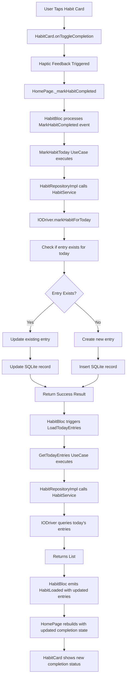

# Complete Habit Workflow

## Overview
This fluxogram illustrates the process of marking a habit as completed for the current day, including the data flow through all architecture layers.

## Workflow Steps

## Architecture Layers Involved

### Presentation Layer
- **HabitCard Widget**: Individual habit display component
- **HomePage**: Main container managing habit interactions
- **HabitBloc**: State management for completion operations

### Domain Layer
- **HabitEntry Entity**: Represents daily completion status
- **MarkHabitToday UseCase**: Business logic for marking completion
- **GetTodayEntries UseCase**: Business logic for fetching today's status

### Data Layer
- **HabitRepositoryImpl**: Repository implementation
- **HabitService**: Service abstraction layer
- **IODriver**: SQLite database operations

## User Interaction Patterns

### Touch Interactions
- **Single Tap**: Toggle completion status
- **Long Press**: Quick toggle completion (accessibility feature)
- **Double Tap**: Expand/collapse habit details

### Visual Feedback
- **Haptic Feedback**: Light impact for completion, selection click for un-completion
- **Animation**: Smooth checkbox transition with AnimatedSwitcher
- **Color Changes**: Success colors for completed state

## Data Operations

### Marking Completion
1. **Check Existing Entry**: Query for today's habit entry
2. **Create/Update**: Create new entry or update existing one
3. **Set Completion Status**: Update isCompleted and completedAt fields
4. **Refresh Data**: Reload today's entries to reflect changes

### Entry Management
- **Default Entries**: Auto-created for habits without today's entry
- **Unique Constraint**: One entry per habit per day
- **Timestamp Tracking**: completedAt records exact completion time

## Error Handling

- **Database Errors**: Handled by Result pattern with specific error codes
- **Concurrency**: SQLite handles concurrent operations safely
- **Missing Data**: Default entries created when no entry exists

## Performance Considerations

- **Efficient Queries**: Single query for today's entries
- **Minimal Rebuilds**: BLoC ensures only affected widgets rebuild
- **Local Storage**: No network latency for completion operations