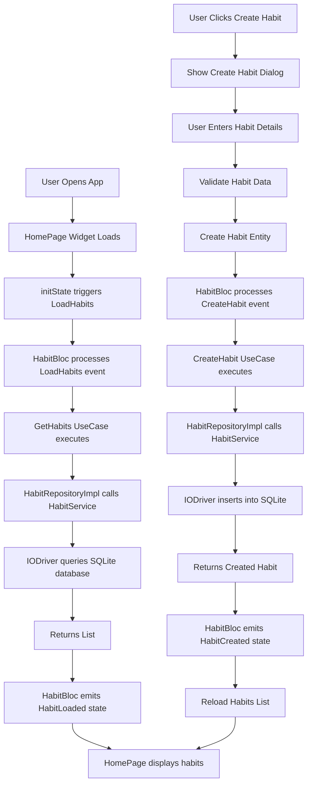

# Create New Habit Workflow

## Overview
This fluxogram illustrates the process of creating a new habit in the Daymark app, following the Clean Architecture pattern.

## Workflow Steps

## Architecture Layers Involved

### Presentation Layer
- **HomePage Widget**: Main UI component
- **HabitBloc**: State management for habit operations
- **Create Habit Dialog**: UI for habit creation

### Domain Layer
- **Habit Entity**: Core business object
- **CreateHabit UseCase**: Business logic for habit creation
- **HabitRepository Interface**: Contract for data operations

### Data Layer
- **HabitRepositoryImpl**: Repository implementation
- **HabitService**: Service abstraction layer
- **IODriver**: SQLite database operations

## Data Flow

1. **User Input**: User provides habit name and description
2. **Validation**: Client-side validation of required fields
3. **Entity Creation**: Habit entity created with unique ID and timestamps
4. **Repository Call**: UseCase calls repository with new habit
5. **Database Insert**: IODriver inserts habit into SQLite database
6. **State Update**: BLoC emits new state with updated habits list
7. **UI Refresh**: HomePage rebuilds with new habit

## Error Handling

- **Validation Errors**: Displayed in the create dialog
- **Database Errors**: Handled by Result<T, ErrorCode> pattern
- **Network Errors**: Currently local-only, but prepared for future

## Key Components

- **Habit Entity**: Contains id, name, description, createdAt, updatedAt
- **Result Pattern**: Ensures type-safe error handling
- **SQLite Database**: Local storage with proper schema
- **BLoC Pattern**: Clean state management separation