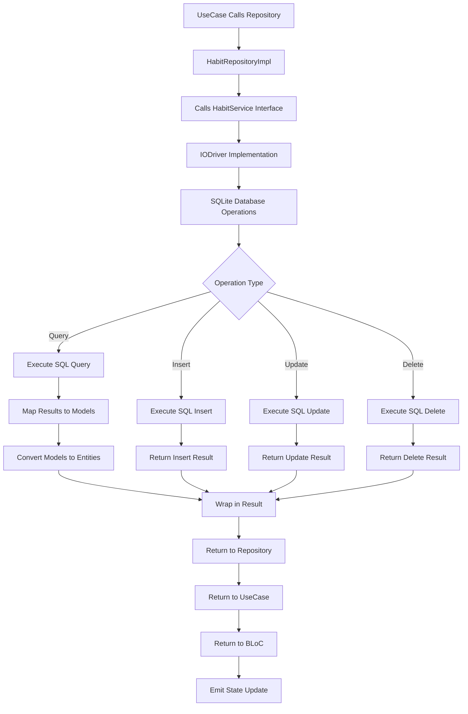

# Service Abstraction Layer Workflow

## Overview
This fluxogram illustrates how the service abstraction layer handles data operations, providing a clean separation between business logic and data persistence while supporting multiple data sources.

## Workflow Steps



## Architecture Layers and Responsibilities

### Domain Layer (Pure Business Logic)
- **HabitRepository Interface**: Contract defining data operations
- **UseCases**: Business logic orchestrators
- **Entities**: Core business objects (Habit, HabitEntry)

### Data Layer (Implementation Details)
- **HabitRepositoryImpl**: Repository implementation
- **HabitService Interface**: Service abstraction contract
- **IODriver**: Concrete SQLite implementation
- **Data Models**: Database-specific representations

## Service Abstraction Benefits

### Clean Architecture Compliance
- **Dependency Inversion**: Domain depends on abstractions, not implementations
- **Testability**: Easy mocking of service interfaces
- **Flexibility**: Easy to swap data sources (SQLite → Firebase → REST API)

### Error Handling Pattern
```dart
FutureResult<T, ErrorCode> pattern:
- Success(T data) for successful operations
- Failure(ErrorCode) for error conditions
- Type-safe error handling throughout the app
```

## Data Flow Details

### Query Operations
1. **SQL Execution**: Raw SQL queries with proper parameterization
2. **Model Mapping**: Convert database maps to data models
3. **Entity Conversion**: Convert models to domain entities
4. **Result Wrapping**: Wrap in success/failure result

### Mutation Operations
1. **Entity Validation**: Validate business rules before persistence
2. **Model Conversion**: Convert entities to data models
3. **SQL Execution**: Execute insert/update/delete operations
4. **Result Handling**: Return operation success/failure

## Database Schema Management

### Tables Structure
- **habits table**: id, name, description, createdAt, updatedAt, isActive
- **habit_entries table**: id, habitId, date, isCompleted, completedAt
- **Foreign Key**: habit_entries.habitId references habits.id
- **Unique Constraint**: One entry per habit per day

### Migration Support
- **Version Management**: Database version tracking
- **Schema Updates**: Forward-compatible schema changes
- **Data Migration**: Safe data transformation between versions

## Future Extensibility

### Multiple Data Sources
- **Local First**: SQLite for offline functionality
- **Cloud Sync**: Future Firebase integration
- **REST API**: Potential web service integration
- **Hybrid Approach**: Local cache with cloud synchronization

### Service Implementations
- **IODriver**: Current SQLite implementation
- **FirebaseDriver**: Potential cloud implementation
- **MockDriver**: Testing implementation
- **HybridDriver**: Combined local/cloud strategy

## Testing Strategy

### Unit Testing
- **Repository Tests**: Mock HabitService for isolated testing
- **UseCase Tests**: Test business logic without persistence
- **Service Tests**: Test specific service implementations

### Integration Testing
- **Database Tests**: Test actual SQLite operations
- **End-to-End**: Test complete data flow through all layers
- **Performance Tests**: Verify database performance under load

## Performance Optimizations

### Database Operations
- **Efficient Queries**: Properly indexed queries
- **Batch Operations**: Multi-row operations when possible
- **Connection Pooling**: Reuse database connections
- **Transaction Support**: ACID compliance for critical operations

### Memory Management
- **Stream Control**: Proper disposal of database streams
- **Result Handling**: Efficient error propagation
- **Model Lifecycle**: Proper cleanup of data models