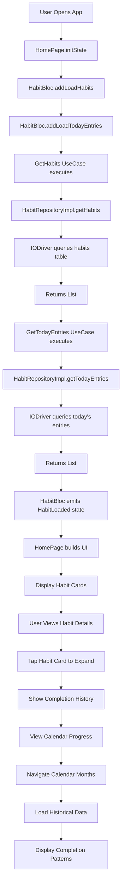

# View Habits and History Workflow

## Overview
This fluxogram illustrates how users can view their habits, check completion history, and navigate through the app's data visualization features.

## Workflow Steps

## Architecture Layers Involved

### Presentation Layer
- **HomePage**: Main container with responsive layout
- **HabitCard**: Individual habit display with expandable details
- **CalendarView**: Monthly calendar with completion visualization
- **ResponsiveWidget**: Adapts layout for mobile/tablet

### Domain Layer
- **Habit Entity**: Core habit data structure
- **HabitEntry Entity**: Daily completion records
- **GetHabits UseCase**: Business logic for fetching habits
- **GetTodayEntries UseCase**: Business logic for today's status

### Data Layer
- **HabitRepositoryImpl**: Repository implementation
- **HabitService**: Service abstraction layer
- **IODriver**: SQLite database operations

## UI Components and Features

### Habit Cards
- **Compact View**: Name, description, completion checkbox
- **Expanded View**: Detailed history, creation date, completion time
- **Interactive Elements**: Tap to expand, long press for quick actions

### Calendar View
- **Monthly Overview**: Grid layout showing completion patterns
- **Completion Indicators**: Color-coded dots showing completion count
- **Navigation**: Previous/next month buttons
- **Today Highlight**: Current day clearly marked

### Responsive Design
- **Mobile Layout**: Single column list view
- **Tablet Layout**: Two-column grid with larger calendar
- **Adaptive Padding**: Responsive spacing based on screen size

## Data Loading Strategy

### Initial Load
1. **Load Habits**: Fetch all active habits from database
2. **Load Today's Entries**: Fetch completion status for current day
3. **Combine Data**: Merge habits with their today's entries
4. **Build UI**: Render habit cards with completion status

### Historical Data
- **Lazy Loading**: Calendar loads historical data on demand
- **Efficient Queries**: Date-range queries for specific months
- **Caching**: Local SQLite provides fast access to historical data

## User Experience Features

### Visual Feedback
- **Completion Progress**: Today's completion count (X/Y habits)
- **Calendar Heatmap**: Visual completion patterns over time
- **Empty States**: Helpful illustrations when no habits exist
- **Loading States**: Shimmer effects during data loading

### Accessibility
- **Semantic Labels**: Screen reader support for all interactive elements
- **Touch Targets**: Adequate sizing for all interactive elements
- **Color Contrast**: WCAG compliant color schemes
- **Haptic Feedback**: Tactile responses for key interactions

## Performance Optimizations

- **Efficient Rebuilds**: BLoC ensures minimal widget rebuilds
- **Database Indexing**: Proper indexes on habitId and date fields
- **Memory Management**: Proper disposal of controllers and streams
- **Image Optimization**: Efficient loading of illustrations and icons